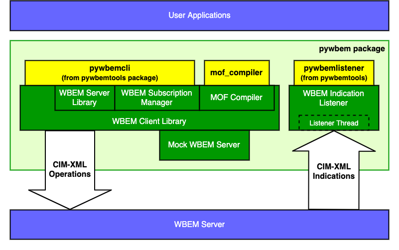

Pywbem - A WBEM client and related utilities, written in pure Python
====================================================================

.. # begin of customization for the current version
.. |pywbem-version| replace:: 0.14.1
.. |pywbem-next-version| replace:: 1.0.0
.. |pywbem-next-issue| replace:: 1413
.. # end of customization for the current version

.. |pywbem-next-issue-link-1| raw:: html

    <a href="https://github.com/pywbem/pywbem/issues/

.. |pywbem-next-issue-link-2| raw:: html

    ">issue

.. |pywbem-next-issue-link-3| raw:: html

    </a>

.. |pywbem-next-issue-link| replace:: |pywbem-next-issue-link-1|\ |pywbem-next-issue|\ |pywbem-next-issue-link-2| |pywbem-next-issue|\ |pywbem-next-issue-link-3|

.. |os-setup-link| raw:: html

    <a href="https://pywbem.readthedocs.io/en/stable/_downloads/pywbem_os_setup.sh">pywbem_os_setup.sh</a>

.. image:: https://img.shields.io/pypi/v/pywbem.svg
    :target: https://pypi.python.org/pypi/pywbem/
    :alt: Version on Pypi

.. # .. image:: https://img.shields.io/pypi/dm/pywbem.svg
.. #     :target: https://pypi.python.org/pypi/pywbem/
.. #     :alt: Pypi downloads

.. image:: https://travis-ci.org/pywbem/pywbem.svg?branch=master
    :target: https://travis-ci.org/pywbem/pywbem
    :alt: Travis test status (master)

.. image:: https://ci.appveyor.com/api/projects/status/i022iaeu3dao8j5x/branch/master?svg=true
    :target: https://ci.appveyor.com/project/andy-maier/pywbem
    :alt: Appveyor test status (master)

.. image:: https://readthedocs.org/projects/pywbem/badge/?version=latest
    :target: https://pywbem.readthedocs.io/en/latest/
    :alt: Docs build status (master)

.. image:: https://img.shields.io/coveralls/pywbem/pywbem.svg
    :target: https://coveralls.io/r/pywbem/pywbem
    :alt: Test coverage (master)

.. image:: https://img.shields.io/badge/Liicense-LGPL 2.1-green.svg

.. image:: https://img.shields.io/pypi/pyversions/pywbem.svg?color=brightgreen
    :alt: PyPI - Python Version

.. # .. contents:: **Contents:**
.. #    :local:

Overview
--------

Pywbem is a WBEM client and WBEM indication listener, written in pure Python.
It runs on Python 2 and Python 3.

The latest released version of pywbem is |pywbem-version|.

The major components of pywbem are shown in this diagram:

A WBEM client allows issuing operations to a WBEM server, using the CIM
operations over HTTP (CIM-XML) protocol defined in the DMTF standards
DSP0200 and DSP0201. The CIM/WBEM infrastructure is used for a wide
variety of systems management tasks supported by systems running WBEM servers.
See `WBEM Standards <https://www.dmtf.org/standards/wbem>`_ for more
information about WBEM and these standards.

A `WBEM indication listener`_ allows receiving indications generated by a
WBEM server.

.. _WBEM indication listener: https://pywbem.readthedocs.io/en/stable/indication.html#wbemlistener

Pywbem also includes higher level classes to support typical WBEM client
activities:

* `WBEMSubscriptionManager`_ -  provides APIs for viewing and managing
  indication subscriptions on a WBEM server.

.. _WBEMSubscriptionManager: https://pywbem.readthedocs.io/en/stable/indication.html#wbemsubscriptionmanager

* `WBEMServer`_ - provides APIs for managing basic characteristics of
  a WBEM server including:

  * finding CIM namespaces and the Interop namespace,
  * finding WBEM management profiles,
  * finding basic information about the WBEM server.

.. _WBEMServer: https://pywbem.readthedocs.io/en/stable/server.html

Installation
------------

To install the latest released version of pywbem on Linux:

* Install the prerequisite OS-level packages:

  * Download the |os-setup-link| script

  * Execute that script:

    .. code-block:: bash

        $ ./pywbem_os_setup.sh

* With your target Python environment active, install pywbem:

  .. code-block:: bash

      $ pip install pywbem

  This will also install any prerequisite Python packages.

For more details, installation on other operating systems, and alternative
ways to install, see the
`Installation section`_ in the pywbem documentation.

.. _Installation section: https://pywbem.readthedocs.io/en/stable/intro.html#installation

Documentation
-------------

The latest pywbem documentation is available on ReadTheDocs:

* `Documentation for latest released version`_

.. _Documentation for latest released version: https://pywbem.readthedocs.io/en/stable/

* `Documentation for latest unreleased development version`_

.. _Documentation for latest unreleased development version: https://pywbem.readthedocs.io/en/latest/

The documentation includes API documentation, user documentation,
tutorial documentation, developer documentation.

This includes a number of Jupyter notebooks that act as a `Tutorial`_ and
provide working examples of pywbem API usage.

.. _Tutorial: https://pywbem.readthedocs.io/en/stable/tutorial.html

There are also a number of `Presentations`_ on the status, concepts, and implementation
of pywbem available.

.. _Presentations: https://pywbem.github.io/pywbem/documentation.html

The detailed change history for the latest released version in the
`Change log section`_.

.. _Change log section: https://pywbem.readthedocs.io/en/stable/changes.html

Command line tools
------------------

Pywbem includes two command line tools:

*  `wbemcli`_ - An interactive shell for issuing WBEM operations against a WBEM
   server. In addition to executing the WBEM operations directly, simple
   scripts can be created to be executed within `wbemcli`.

.. _wbemcli: https://pywbem.readthedocs.io/en/stable/utilities.html#wbemcli

*  `mof_compiler`_ - A MOF compiler to compile MOF into repositories (e.g.
   WBEM servers) or to test compile MOF.

.. _mof_compiler: https://pywbem.readthedocs.io/en/stable/utilities.html#mof-compiler

Quick Start
-----------

The following simple example script lists the namespaces and the Interop
namespace in a particular WBEM server:

.. code-block:: python

    #!/usr/bin/env python

    import pywbem

    server_uri = 'http://localhost'
    user = 'fred'
    password = 'blah'

    conn = pywbem.WBEMConnection(server_uri, (user, password))

    server = pywbem.WBEMServer(conn)

    print("Interop namespace:\n  %s" % server.interop_ns)

    print("All namespaces:")
    for ns in server.namespaces:
        print("  %s" % ns)

Project Planning
----------------

For each upcoming release, the bugs and feature requests that are planned to
be addressed in that release are listed in the
`issue tracker <https://github.com/pywbem/pywbem/issues>`_
with an according milestone set that identifies the target release.
The due date on the milestone definition is the planned release date.
There is usually also an issue that sets out the major goals for an upcoming
release.

Planned Next Release
--------------------

Pywbem |pywbem-next-version| is in development.

Pywbem |pywbem-next-issue-link| defines the basic direction for version
|pywbem-next-version|.

Contributing
------------

For information on how to contribute to pywbem, see the
`Contributing section`_ in the pywbem documentation.

.. _Contributing section: https://pywbem.readthedocs.io/en/stable/development.html#contributing

License
-------

Pywbem is provided under the
`GNU Lesser General Public License (LGPL) version 2.1
<https://raw.githubusercontent.com/pywbem/pywbem/master/LICENSE.txt>`_,
or (at your option) any later version.
